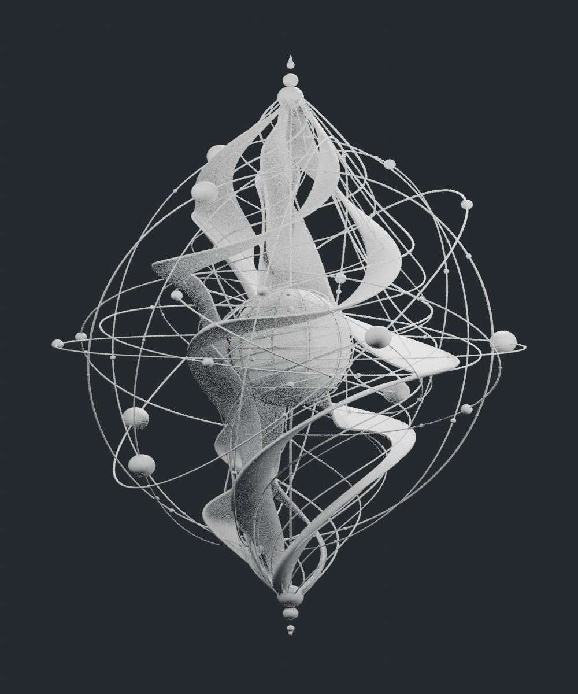
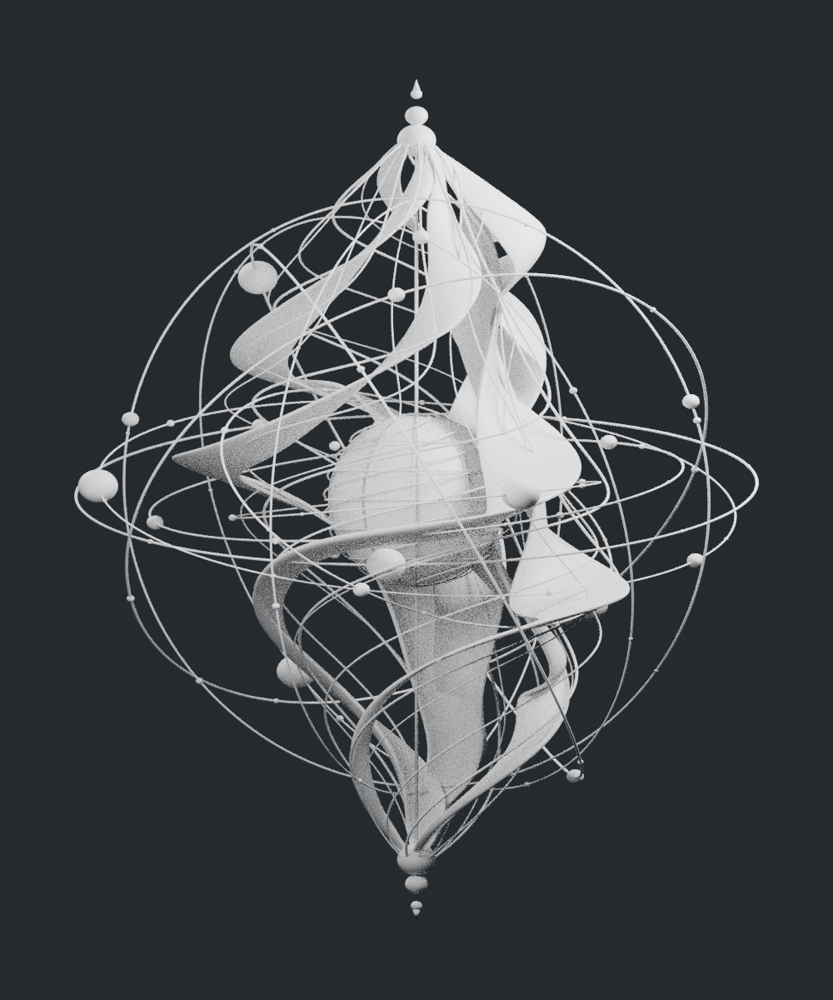
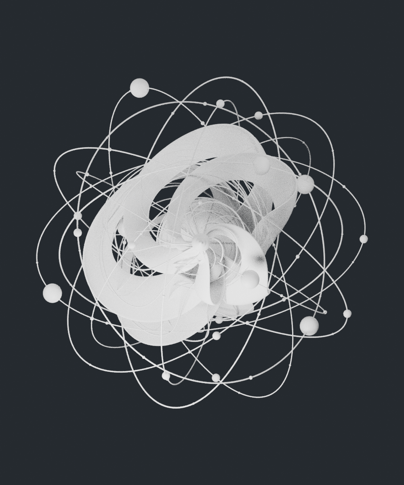
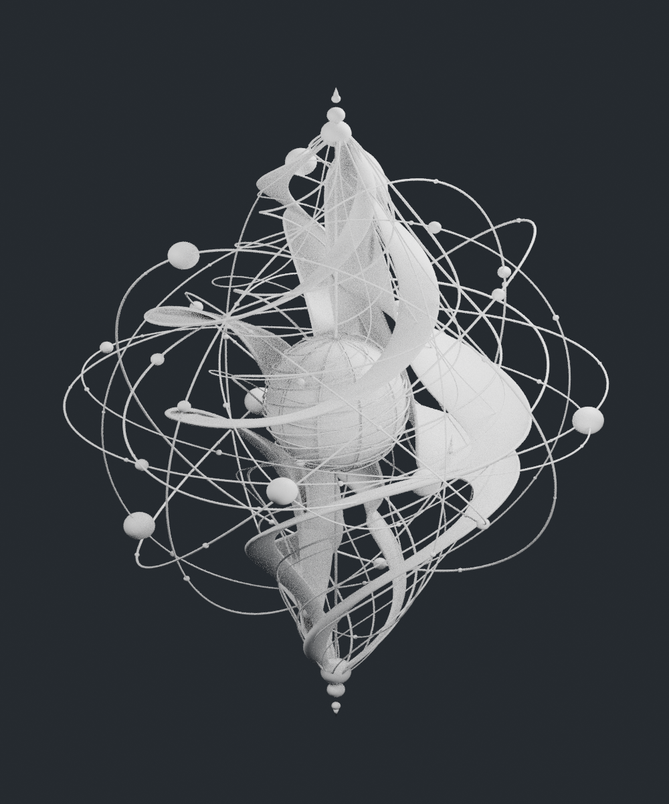
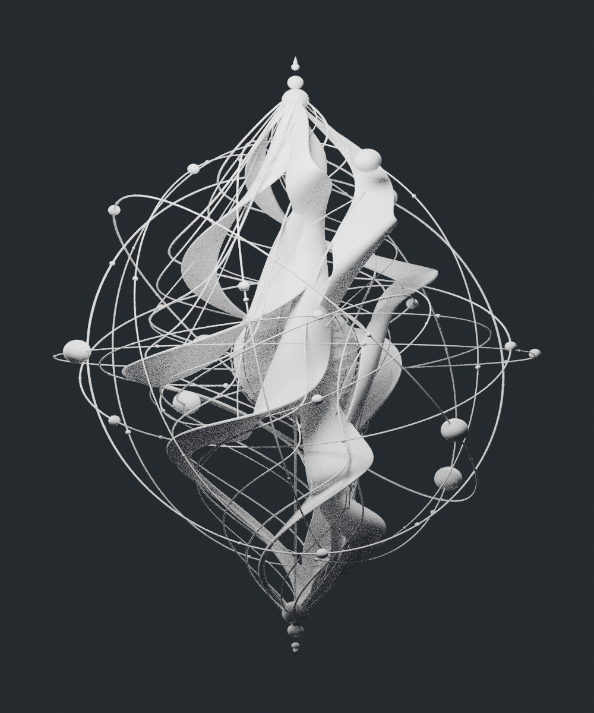

# 多视图版 · 8 米能量雕塑白模 v2

依据用户提供的正视图、侧视图、俯视图、四项局部特写和运动示意重新生成。统一哑光白材质，不包含透明发光渲染。旧版保留在 `../energy-sculpture/`。

## 尺寸与结构

参考静止姿态位于第 1 帧，模型整体包围盒为 **X 6.5 米 × Y 6.5 米 × Z 8 米**，包含轨道、球节点与轴端收尾。`geometry_report.json` 记录实际计算尺寸与各部件封闭性检查。

- 5 条实体流动带：变化的带宽、曲率、倾角、卷曲起伏、闭合厚度与圆润边缘。
- 25 条带面凸起脉络与边缘细丝，15 条独立伴随流线。
- 中央椭球核心，10 条经线、5 条纬线、6 条螺旋表面细线及轴向珠节点。
- 10 条完整倾斜椭圆轨道，20 个大球节点与 70 个小珠。
- 连续中轴、顶部和底部珠串、实体尖端。

参考图是多视图概念图，并非具有精确截面尺寸的工程图。这里保留可辨识的主要造型与局部结构，曲面、交叠深度和内部关系按三维建模推定；不能保证与原作者未提供的源模型逐面一致。图片中的纯光芒和闪点不作为实体毛刺。

## 文件与动画

- `white_model_8m.blend`：完整白模、灯光、相机和原生动画控制。
- `white_model_8m.obj` / `white_model_8m.stl`：第 1 帧静态网格导出。
- `white_model_package.zip`：以上文件、5 张预览、生成脚本和检查报告。
- `build.py`：在 Blender 4.3.2 中可复现生成。

动画为 1–241 帧，24 FPS，约 10 秒周期：`Core spin` 控制核心旋转；20 个轨道球沿各自椭圆移动；`Ribbon breathing` 控制流动带水平收缩和舒张。第 61 帧收缩，第 181 帧舒张。8 米和 6.5 米标注对应第 1 帧基准姿态，舒张时水平尺寸会增大。

所有模型部件为独立封闭网格，存在相互交叠，未整体布尔融合。文件用于造型查看与继续编辑，尚未完成制造或打印适配。

## 正视图



## 侧视图



## 俯视图



## 透视图



## 背视图



## 重新生成

```bash
blender -b --python models/energy-sculpture-v2/build.py
```
