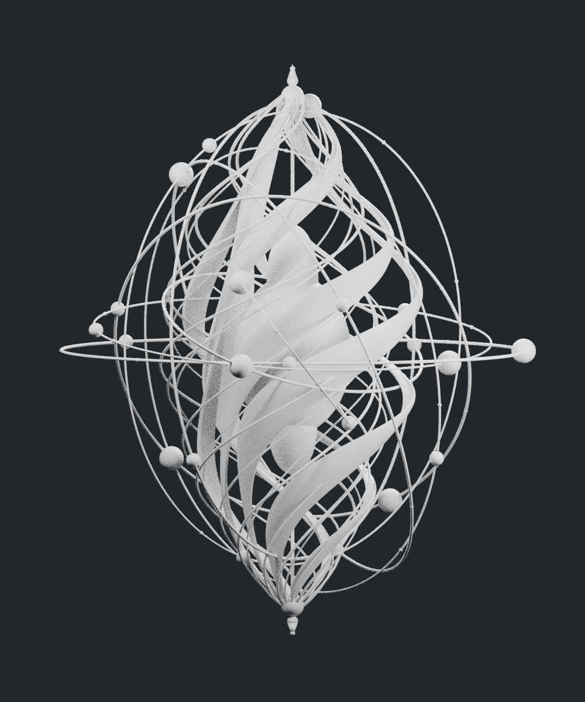
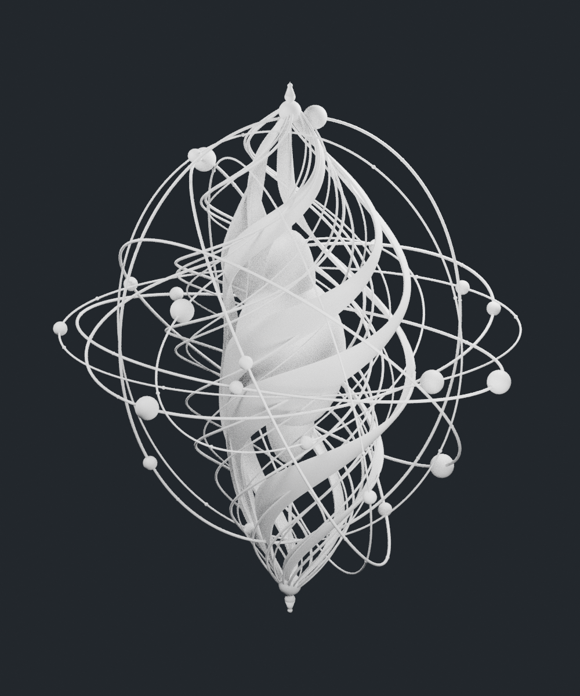
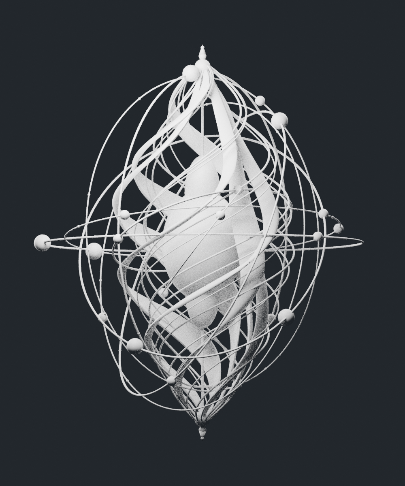
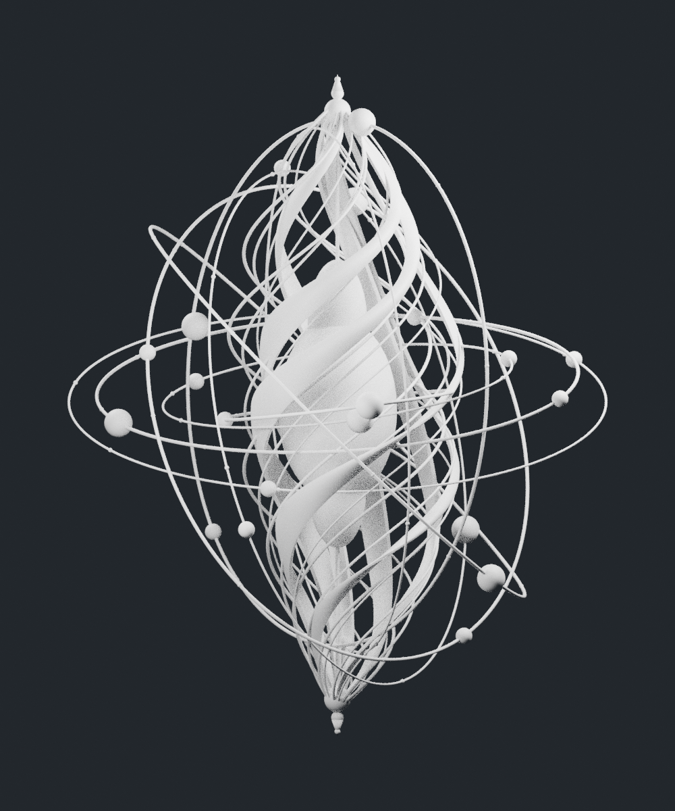

# 8 米环绕能量雕塑 · 白模

依据用户提供的正视参考图重建的完整三维白模。所有模型部件为统一哑光白色；总高度 8 米。

## 文件

- `energy_sculpture_white.blend`：Blender 4.3.2 场景，WHITE_MODEL 集合包含模型，STUDIO 集合包含相机和灯光。
- `energy_sculpture_white.obj`：通用白模网格，无材质依赖。
- `energy_sculpture_white.stl`：三角网格导出。
- `preview_front.png` / `preview_perspective.png` / `preview_back.png` / `preview_side.png`：正面、透视、背面、侧面预览。
- `build.py`：可复现 Blender 生成脚本。
- `geometry_report.json`：网格完整性检查报告。

## 结构

中央椭球核心、上下辅助核心、连续中轴、6 条有厚度的扭转带、14 条环绕细丝、9 条完整倾斜椭圆轨道、轨道球节点和小珠、上下珠状收尾与尖端。轨道均为完整三维闭环，扭转带有实体厚度与封边。

## 参考范围

原图是透明发光效果的单张正视概念图；这份白模将主要可辨识的带状、球状与线状元素转化为实体几何。背面、遮挡区域与内部构造根据正面轮廓推定，无法仅凭单张图验证与原作者设计完全一致。光芒、闪点和透明光效不作为实体零件逐像素建模。

模型由独立封闭部件构成，部分相互交叠，未进行整体布尔融合。STL 不代表已完成打印适配；如需制造，还需确定结构连接、最小厚度和加工工艺。

运行生成脚本：

```bash
blender -b --python models/energy-sculpture/build.py
```

## 正面预览



## 透视预览



## 背面预览



## 侧面预览


