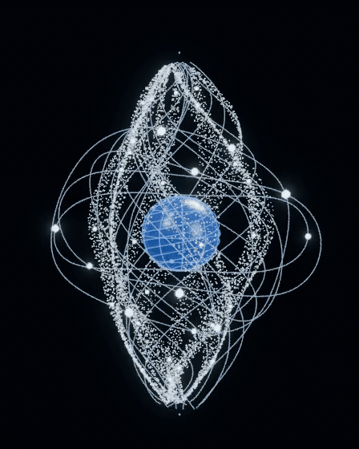

# 光核 · 水母式收缩与半透明粒子流

以用户提供的 4.04 秒水母视频为运动参考，重做外围结构与主节律。保留 **8 米光核、不加底座**；中央蓝色核心固定尺寸并自转。

[播放或下载 24 FPS 动态视频](preview_jelly.mp4) · [下载 Blender 模型](light_core_jelly.blend) · [下载完整包](light_core_jelly_package.zip)



## 这次的变化

- **S 形光带改成粒子群**：移除原来硬质的实体带面，改用 6,720 颗可见的发光粒子。透明着色混合比例为 0.52，多层颗粒可相互透视。粒子按路径弧长分布并流动。
- **整体有明确主收缩**：每约 2.67 秒完成一次呼吸，约 24% 时间收拢、76% 时间回弹展开，8 秒内完成三次。以共同节律带动各条外围结构，避免各自摆动却看不出整体收缩。
- **收缩推动整体上升**：快速收拢时上升，缓慢展开时回落，总上下行程约 0.48 米。
- **外围线条有滞后和弯曲**：14 条长细丝与 6 条非平面轨道叠加沿高度传播的波动，下段反应更迟、侧向摆幅更大。
- **粒子与光珠随水流形变**：25 个亮珠沿 S 形粒子带流动，12 个外围亮点沿变形后的轨迹运行。
- **核心不收缩**：蓝色核心没有形变修改器和缩放动画，仅自转并随整体起伏。

这里提取水母视频中“快收缩、慢展开、上推进、细丝滞后”的运动关系，并按 8 米装置的观看节奏重新编排，没有逐帧照搬原视频速度。原视频保留在会话附件中，没有上传至公开仓库。

## 文件与查看

- `light_core_jelly.blend`：完整可编辑动画，24 FPS，1–192 帧，8 秒无缝循环。
- `preview_jelly.mp4`：实际 Blender 渲染，24 FPS。
- `preview_jelly.gif`：供 GitHub 页面浏览的动态预览。
- `jelly_motion_report.json`：主节律、浮动、核心尺寸与循环接续的检查结果。
- `build_jelly.py`：生成脚本；需要仓库内 `../light-core-motion/light_core_motion.blend` 作为核心和摄影棚来源。

打开 Blender 文件，按空格播放。材质预览或渲染模式可见半透明与发光效果。粒子通过几何节点实例化，水流位置和弯曲使用原生形态键，动画已保存在文件内，不依赖外部播放脚本。

S 形颗粒对象、细丝对象、流动光珠和轨道节点都可以分别编辑。没有底座或原有不透明带面。

```bash
blender -b --python models/light-core-jelly/build_jelly.py -- --model-only
blender -b --python models/light-core-jelly/build_jelly.py
```

渲染序列默认保存在仓库根目录的 `work/light-core-jelly-frames/`。
