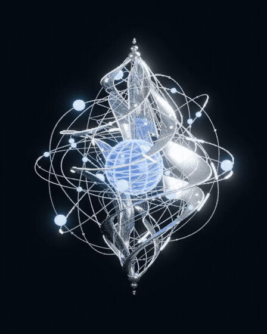

# 光核 · 五层运动模型

基于仓库中 8 米多视图白模，加入银色主体、蓝色核心与白色发光细带。模型源尺寸沿用高 8 米、水平 6.5 米的 v2；运动中包围盒会随收缩、舒张和浮动改变。

## 动态预览



[播放或下载 MP4](preview_motion.mp4) · [下载 Blender 动画模型](light_core_motion.blend) · [下载完整包](light_core_package.zip)

## 五项运动

| 元素 | 动作 |
| --- | --- |
| 蓝色核心 | 10 秒内绕竖轴自转两圈；表面经纬细线和螺旋纹理随核心转动。 |
| 外围光条 | 10 条短发光弧段沿各自完整椭圆轨道移动，弧段自身保持轨迹曲率。 |
| 白色光带中的光珠 | 25 颗光珠沿带面中心线流动，由一条带上行、相邻带下行，在尖端接续成闭环。 |
| 外围线条 | 一个 10 秒周期中非对称收缩与舒张；水平方向收缩时竖向略微拉长，模拟水母节律。 |
| 整个光核 | 上下轻浮，位移幅度 ±0.13 米，10 秒一周期。 |

外围另有 20 个球形节点沿各自轨道运行。所有元素同周期闭合，模型时间轴为 1–240 帧，24 FPS，第 241 帧等于下一周期的第 1 帧。

光珠和光条使用路径累计弧长进行位置采样，避免椭圆参数速度造成快慢变化。匀速定义在未形变的轨迹局部坐标中；外围呼吸改变轨迹长度，世界坐标中的瞬时速度会随形变变化。`motion_report.json` 包含运动检查和光珠采样速度。

## 用 Blender 查看

打开 `light_core_motion.blend`，在时间轴按空格播放。材质预览或渲染模式显示银色、蓝色与发光材质；实体模式适合快速检查动作。

`MOTION_CONTROLS` 集合包含核心旋转、外围呼吸、光带呼吸与整体浮动控制。球节点与光珠保存为原生线性关键帧，光条曲线点随时间更新；无需安装第三方插件。根控制对象的上下位移驱动了所有模型元素。

GitHub GIF 和 MP4 是实际 Blender 渲染的 10 秒循环预览，每秒 8 个独立画面；Blender 文件可按完整 24 FPS 渲染。

## 生成脚本

需要相邻的 `../energy-sculpture-v2/white_model_8m.blend`，建议克隆完整仓库。

```bash
# 仅生成及验证模型
blender -b --python models/light-core-motion/build_motion.py -- --model-only

# 生成模型与预览序列
blender -b --python models/light-core-motion/build_motion.py
```

渲染序列写入仓库根目录的 `work/light-core-frames/`。基于参考概念图重建的曲面与交叠关系仍属于造型推定；此动画资产未进行制造或打印适配。
