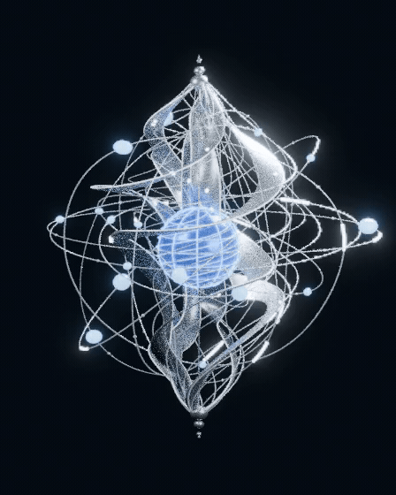

# 光核 · 柔性水流版

这版针对上一版运动过于机械的问题重做外围形变。**中心蓝色核心始终保持固定尺寸，仅自转并随整个光核轻微上下浮动。** 外围取消统一比例缩放，改用每条光带独立的局部卷曲、侧向摆动和不对称收缩。

本次更新：外围形变幅度为上一版的 **2 倍**，收缩舒张速度提高 **30%**；蓝色核心仍保持固定尺寸。

## 动态预览



[播放或下载 MP4](preview_organic.mp4) · [下载 Blender 动画模型](light_core_organic.blend) · [下载完整包](light_core_organic_package.zip)

## 改动

- 5 条主体光带分别使用独立的三维形变控制，波动沿高度传播，根部和尖端减弱摆动。
- 各光带相位、摆幅与径向变化不同；同一光带不同高度的横向、纵向变化也不同。呈现类似海带随水流摆动的节律。
- 10 条外围轨道分别使用独立形变，环绕光条、轨道球和小珠随所属轨道一起运动。
- 发光细线和主体光带共用形变控制；流动光珠根据所处路径段切换控制，随光带形变保持贴合。
- 核心没有任何形变修改器，父级也没有缩放动画。保留蓝色核心自转、轨道光条运行、光珠流动与整体 ±13 厘米浮动。

收缩舒张周期由 10 秒缩短为约 **7.69 秒**。核心自转、光珠运行和整体浮动保留原速度。各项运动完整对齐后为 100 秒循环：时间轴 1–2400 帧，24 FPS，第 2401 帧与第 1 帧接续。每条带各自错相运动，不是所有外围部件同时缩成同一种比例。

## 尺寸与参考范围

沿用已确认的 **8 米光核版本，不含底座**，新版三视图用于指导流动银色光带、中央蓝色核心与外围轨道的视觉关系。新图中的 4.2 米总高、6 米底座没有套用到这个版本；旧资产保留。

造型仍基于参考概念图重建，未标注的曲面与内部关系为建模推定。光珠弧长匀速定义在形变前路径局部坐标中，外围形变会影响其世界坐标瞬时速度。

## 查看与编辑

用 Blender 4.3.2 打开 `light_core_organic.blend`，在时间轴按空格播放。材质预览或渲染模式显示银色、蓝色与发光材质，实体模式便于快速检查动作。

`INDEPENDENT_WATER_CURRENTS` 集合中的 15 个控制笼对应 5 条主体光带和 10 条轨道。每个控制笼均有局部非线性坐标驱动。与整体浮动一样，驱动表达式使用 Blender 内置数学函数，不需要第三方插件。

`amplitude_speed_update.json`、`organic_motion_report.json` 和 `saved_file_verification.json` 记录保存前与重新打开文件后的检查：核心尺寸不变、统一缩放移除、每条光带实际顶点变化，以及所有水流驱动有效。

GitHub GIF 与 MP4 为实际 Blender 渲染的 10 秒展示片段，每秒 12 个独立画面。原生模型可按完整 24 FPS 渲染。

## 重新生成

生成脚本需要仓库中上一版 `light-core-motion` 的 Blender 文件和脚本，建议克隆完整仓库。新 `.blend` 本身不依赖上一版文件。

```bash
blender -b --python models/light-core-organic/build_organic.py -- --model-only
blender -b --python models/light-core-organic/build_organic.py
```

渲染序列位于仓库的 `work/light-core-organic-frames/`。
